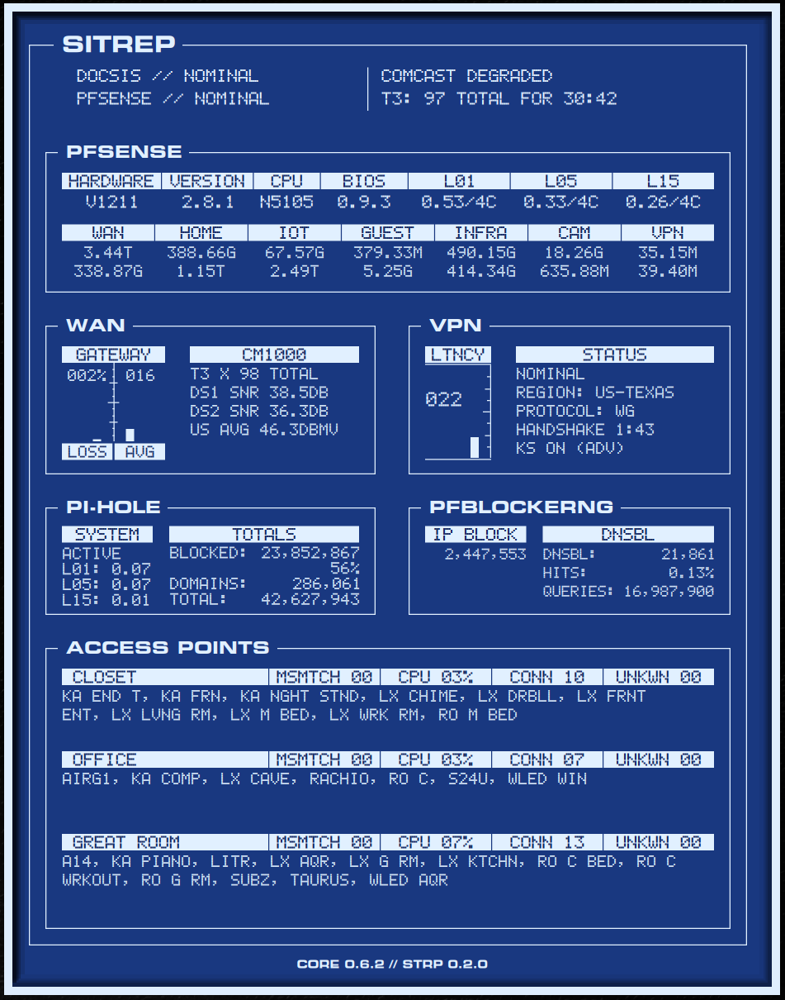

# gtex62-sitrep

`gtex62-sitrep` is a standalone Conky suite built on the shared
[`gtex62-core`](../gtex62-core/README.md) engine model, following the same
suite/engine split as [`gtex62-osa`](../gtex62-osa/README.md).

SitRep is a single-panel network-status console: pfSense/router,
pfBlockerNG, Pi-hole, VPN, cable modem, access point, and device-inventory
status in one chassis. The suite owns the visual language and panel
composition; the engine owns the runtime model, provider orchestration, and
normalized cache SitRep reads from.

## Table of Contents

- [Purpose](#purpose)
- [Screenshots / Design References](#screenshots--design-references)
- [Requirements](#requirements)
- [Installation](#installation)
- [Quick Start](#quick-start)
- [Configuration](#configuration)
- [Runtime Model](#runtime-model)
- [Repository Layout](#repository-layout)
- [Panel Map](#panel-map)
- [Customization](#customization)
  - [Scale](#scale)
  - [Palette](#palette)
- [Troubleshooting](#troubleshooting)
- [Relationship to gtex62-tech-hud](#relationship-to-gtex62-tech-hud)
- [License](#license)

## Purpose

SitRep began as a network-status display inside `gtex62-tech-hud`, doing its
own SSH collection, IP-to-name mapping, and draw-time joins in a single pass.
This repo is the relocation destination for that functionality onto the
engine model, as a suite in its own right rather than a panel folded into
OSA:

- `gtex62-core` owns provider orchestration, SSH collection, device
  classification, and the normalized cache — see
  [SitRep Architecture](../gtex62-core/docs/sitrep-architecture.md) for the
  "engine gathers knowledge, SitRep reports status" principle this follows.
- `gtex62-shared-assets` owns reusable fonts, wallpapers, icons, and shared
  data assets.
- `gtex62-sitrep` owns only SitRep-specific layout, drawing, suite view
  models, documentation, and Conky entrypoints.

The chassis, header (DOCSIS/PFSENSE status + alert banner), and all six
panels — PFSENSE, WAN, VPN, PI-HOLE, PFBLOCKERNG, ACCESS POINTS — are wired
to live engine cache data; this is no longer a structural scaffold. See
[Panel Map](#panel-map) below for a one-line summary of each, and
[docs/reading-the-widget.md](docs/reading-the-widget.md) for the full field
guide — what each number means, where it comes from, and what's still a
known placeholder or deferred field.

## Screenshots / Design References



*`blueprint` palette. PFSENSE, WAN, VPN, PI-HOLE, PFBLOCKERNG, and ACCESS
POINTS all reading live data, with the header alert banner showing an
active `COMCAST DEGRADED` condition.*

## Requirements

Base runtime:

- Conky with Lua + Cairo support, for example `conky-all`
- `bash`, `jq`, `curl`
- `python3` (3.11 or newer recommended; `jq` and `python3` are checked at launch)
- `lua` or Lua support through Conky
- `feh` if you want the launcher to apply shared wallpapers

Data sources, each independently enabled or disabled in
`~/.config/gtex62-core/core.toml`:

- SSH target for pfSense-backed network data (system info, interfaces,
  gateway meter, pfBlockerNG).
- Pi-hole and pfBlockerNG, if those optional pfSense packages are installed.
- SSH target for a Pi5 (or similar), if you want Pi-hole stats and the
  gateway-outage MTR trace watcher.
- VPN, cable modem, and access point credentials, per whichever of those
  device classes you actually own.

Shared repositories expected next to this suite:

```text
~/.config/conky/
├── gtex62-core/
├── gtex62-sitrep/
└── gtex62-shared-assets/
```

## Installation

Install system packages. Debian / Ubuntu / Mint example:

```bash
sudo apt update
sudo apt install -y conky-all jq curl python3 lua5.4 feh
```

Clone the engine, shared assets, and suite into the Conky config root:

```bash
mkdir -p ~/.config/conky
cd ~/.config/conky
git clone https://github.com/GTex62/gtex62-core.git
git clone https://github.com/GTex62/gtex62-shared-assets.git
git clone https://github.com/GTex62/gtex62-sitrep.git
```

Install fonts from shared assets, if SitRep's chosen fonts aren't already
present:

```bash
bash ~/.config/conky/gtex62-core/scripts/install-fonts.sh
```

This copies all fonts from `gtex62-shared-assets/fonts/` into
`~/.local/share/fonts/` and rebuilds the font cache.

## Quick Start

Bootstrap the runtime config:

```bash
cd ~/.config/conky/gtex62-sitrep
bash scripts/bootstrap-runtime-root.sh
```

Edit the main local config file:

```bash
$EDITOR ~/.config/gtex62-core/site.toml
```

Then launch SitRep:

```bash
bash ~/.config/conky/gtex62-sitrep/scripts/start-conky.sh
```

The launcher asks for a palette and a shared wallpaper, exports the runtime
paths, and then delegates to:

```text
~/.config/conky/gtex62-core/bin/gtex62-core-launch --suite sitrep
```

## Configuration

Most local setup belongs in one file:

```text
~/.config/gtex62-core/site.toml
```

Domain profile files exist under:

```text
~/.config/gtex62-core/profiles/
```

Provider enable/disable flags (pfSense, VPN, AP, modem, and the pfSense
sub-domains) live in:

```text
~/.config/gtex62-core/core.toml
```

Runtime suite binding lives at:

```text
~/.config/gtex62-core/suites/sitrep.toml
```

## Runtime Model

Standard engine roots:

```text
config  ~/.config/gtex62-core/
data    ~/.local/share/gtex62-core/
cache   ~/.cache/gtex62-core/
assets  ~/.config/conky/gtex62-shared-assets/
```

Environment variables SitRep's Lua reads, same convention as OSA:

- `CONKY_SUITE_DIR`
- `GTEX62_CORE_DIR`
- `GTEX62_CONFIG_DIR`
- `GTEX62_CACHE_DIR`
- `GTEX62_SHARED_ASSETS`
- `GTEX62_SUITE_ID`

See the core README and docs for provider schemas and cache contracts:

- [gtex62-core README](../gtex62-core/README.md)
- [Core Architecture](../gtex62-core/docs/architecture.md)
- [SitRep Architecture](../gtex62-core/docs/sitrep-architecture.md)

## Repository Layout

```text
gtex62-sitrep/
├── suite.toml      # suite identity, entrypoints, shared asset roots
├── README.md
├── design/         # previz images + design notes (gitignored, local only)
├── docs/           # SitRep-only implementation notes and references
├── lua/
│   ├── lib/        # thin local compatibility/helper layer
│   ├── suite/      # SitRep view models over engine cache, one file per panel
│   ├── ui/         # chassis and panel drawing
│   └── widgets/    # Conky Lua entrypoint
├── scripts/        # SitRep launch/wrapper helpers only
├── theme/          # layout, panels, and visual theme
└── widgets/        # Conky config entrypoints
```

Not present by design:

- `assets/`
- `fonts/`
- `examples/`
- `legacy/config/`

Current implementation state:

- `theme/theme.lua`, `theme/layout.lua`, `theme/panels.lua`,
  `theme/palettes.lua` — fully resolved; palette selection, frame geometry,
  FX (shadow/lights), and the `boxes` table for all seven panel/header
  regions are in place.
- `lua/suite/pf.lua`, `ap.lua`, `vpn.lua`, `pihole.lua`,
  `pfblockerng.lua` — one view-model module per panel, each reading its own
  slice of the engine cache and running the shared `resolve_state_word()`
  precedence chain (see
  [docs/reading-the-widget.md](docs/reading-the-widget.md)).
  `lua/suite/runtime.lua` is the generic theme/layout/panels loader with
  mtime-based reload underneath all of them.
- `lua/ui/frame.lua` — draws the full chassis and every panel's live
  content (background, panel frames/titles, FX, and each panel's data
  layout).
- `lua/widgets/sitrep_main.lua` + `widgets/sitrep-main.conky.conf` — the
  Conky entrypoint that renders the live widget end to end.
- `lua/lib/` — still empty; nothing has needed a compatibility helper yet.

## Panel Map

One chassis, one titled frame (`SITREP`), subdivided into a header block and
six panels. Full field-by-field detail — what each number means, where it
comes from, and known placeholder/deferred fields — lives in
[docs/reading-the-widget.md](docs/reading-the-widget.md); this is just the
map:

`HEADER`
: Two status lines (DOCSIS modem connectivity, pfSense state) on the left;
  an alert banner on the right that shows active alert conditions
  (Comcast outage/degraded, kill-switch blocking, AP offline, MAC/IP
  mismatch, ...) or `NO ACTIVE ALERTS`, scrolling when more than 3 lines are
  queued.

`PFSENSE`
: System info (hardware, version, CPU, BIOS, load) plus a per-interface
  table (WAN/HOME/IOT/GUEST/INFRA/CAM) and a VPN transfer column — three
  independent collectors, so one can be stale while the others are fine.

`WAN`
: A LOSS/AVG gateway-quality meter plus a CM1000 cable-modem detail column
  (T3 timeout count, downstream SNR pair, upstream power). A live MTR-trace
  row appears only while a gateway outage has triggered the Pi5 trace
  watcher.

`VPN`
: A latency meter plus tunnel status (health, region, protocol, handshake
  age, kill-switch mode).

`PI-HOLE`
: System active/inactive + load, plus blocked/domains/total query counts.

`PFBLOCKERNG`
: IP-block packet count and DNSBL block count/hit-rate/query totals.

`ACCESS POINTS`
: One repeating block per configured AP (client count, CPU, MAC/IP
  mismatches, unknown clients, resolved client-name list).

## Customization

Start with these files:

- [theme/theme.lua](theme/theme.lua): colors, fonts, spacing, frame FX.
- [theme/panels.lua](theme/panels.lua): panel position and box geometry.
- [theme/layout.lua](theme/layout.lua): frame dimensions, column positions,
  and suite scale.
- [widgets/sitrep-main.conky.conf](widgets/sitrep-main.conky.conf): Conky
  window and update interval.

### Scale

The chassis — geometry, line weights, and fonts — scales from two fields in
`theme/layout.lua`:

```lua
layout.scale_mode = "manual"   -- "manual" or "auto"
layout.scale      = 1.0        -- active when scale_mode = "manual"
```

In `"manual"` mode, `layout.scale` is a fixed multiplier applied to all
drawing. In `"auto"` mode, the scale is computed from the environment
variables `CONKY_SCREEN_W` and `CONKY_SCREEN_H` against the base frame
dimensions (`752 × 960`, `layout.frame` in `theme/layout.lua`). Export both
before launching Conky and the suite will fit the screen proportionally.

Restart Conky after changing `scale` or `scale_mode`.

### Palette

SitRep supports a palette selector through `CONKY_SITREP_PALETTE`,
independent of OSA's `CONKY_OSA_PALETTE` — the two suites never share a
palette catalog or runtime selection, even though the catalog shapes match.
Available palettes are defined, grouped by theme (core, signal/phosphor,
material, cartographic, dusk, LCD, and others), in
[theme/palettes.lua](theme/palettes.lua); the default is that file's own
top-level `default` field, which `scripts/start-conky.sh` reads directly to
pre-select the launcher's palette prompt.

Data customization belongs in `~/.config/gtex62-core/site.toml` unless the
change is truly suite-specific.

## Troubleshooting

### Provider flags for your setup

Every data source is gated behind its own flag in
`~/.config/gtex62-core/core.toml`, and **all of them default to false** —
this suite doesn't assume you own a Pi-hole, a VPN subscription, an AP
fleet, or a specific modem model. Enable only what matches your own
network; leaving the rest off renders that panel `DISABLED` (see
[docs/reading-the-widget.md § State-word legend](docs/reading-the-widget.md#1-state-word-legend))
instead of trying to reach a host you don't have and tripping its SSH gate:

| Flag | Panel(s) it feeds |
| --- | --- |
| `providers.pfsense.status` | PFSENSE interface table + WAN gateway meter |
| `providers.pfsense.router` | PFSENSE VERSION/CPU/BIOS/LOAD row |
| `providers.pihole` | PI-HOLE panel |
| `providers.pfsense.pfblockerng` | PFBLOCKERNG panel |
| `providers.vpn` | VPN panel |
| `providers.ap` | ACCESS POINTS panel |
| `providers.modem` | WAN panel's CM1000 detail column |
| `providers.alerts` | header alert banner |

Refresh the runtime examples from core:

```bash
bash scripts/bootstrap-runtime-root.sh --force
```

Check provider outputs once the pfSense/AP providers are enabled and
populated:

```bash
find ~/.cache/gtex62-core/shared -maxdepth 3 -type f | sort
```

If a panel or field shows a state word (`DISABLED`, `UNCONFIGURED`,
`SSH DOWN`, `STALE - <N>M AGO`, `NO DATA`) instead of real data, that's the
shared `resolve_state_word()` chain reporting a real condition, not a
rendering bug — see
[docs/reading-the-widget.md § State-word legend](docs/reading-the-widget.md#1-state-word-legend)
to work out which one and why. If the chassis fails to render at all, check
that `gtex62-core/lua/runtime/window.lua` is reachable from
`GTEX62_CORE_DIR` and that `theme/palettes.lua` still has a `default` entry
matching an existing palette key.

## Relationship to gtex62-tech-hud

`gtex62-tech-hud` remains untouched and keeps running its legacy SitRep via
`~/.local/bin/sitrep`. This repository is a fresh, standalone destination for
the relocated widget — no files are copied from `gtex62-tech-hud` directly;
its SitRep is read-only reference material for what the eventual panel needs
to display, not a source to port from wholesale.

Note this repo takes a different architectural path than
[gtex62-core/docs/archive/sitrep-relocation-plan.md](../gtex62-core/docs/archive/sitrep-relocation-plan.md)
originally sketched: that document plans SitRep as an engine-resident,
suite-independent widget under `gtex62-core/widgets/sitrep/` (command
`sitrep-e`, no `suite.toml`, works with `CONKY_SUITE_DIR` unset). This repo
instead gives SitRep its own suite identity, matching OSA's model. The data
layer this suite consumes — provider cache schemas, enable/disable flags,
staleness handling — is unaffected by that choice and is documented in
`gtex62-core/docs/`.

## License

See [LICENSE](LICENSE).
